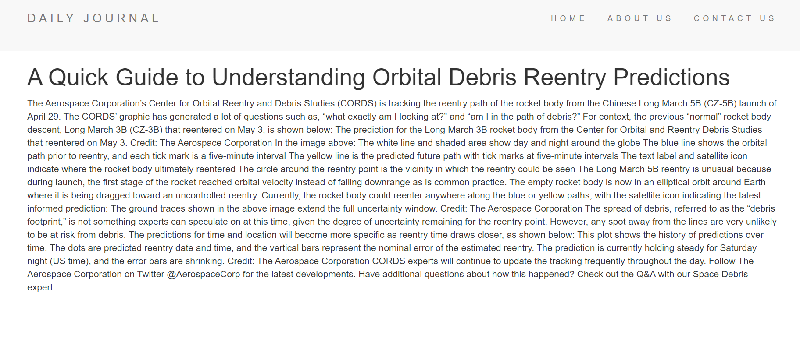

# Daily-Blog
## Make Sure these are installed on your system
* Code Editor (e.g VSCode)
* Node
* MongoDB
## Now Follow these steps to run locally
* clone the repository 
* run ` npm install`
* run ` npm start`

## Demo (Screenshots of the Blog Application)

### Home Page

### Compose Page

## Updated Home Page

## Post Page

# LICENSE
Anyone can use it for learning purposes. Content is licensed under MIT License.
